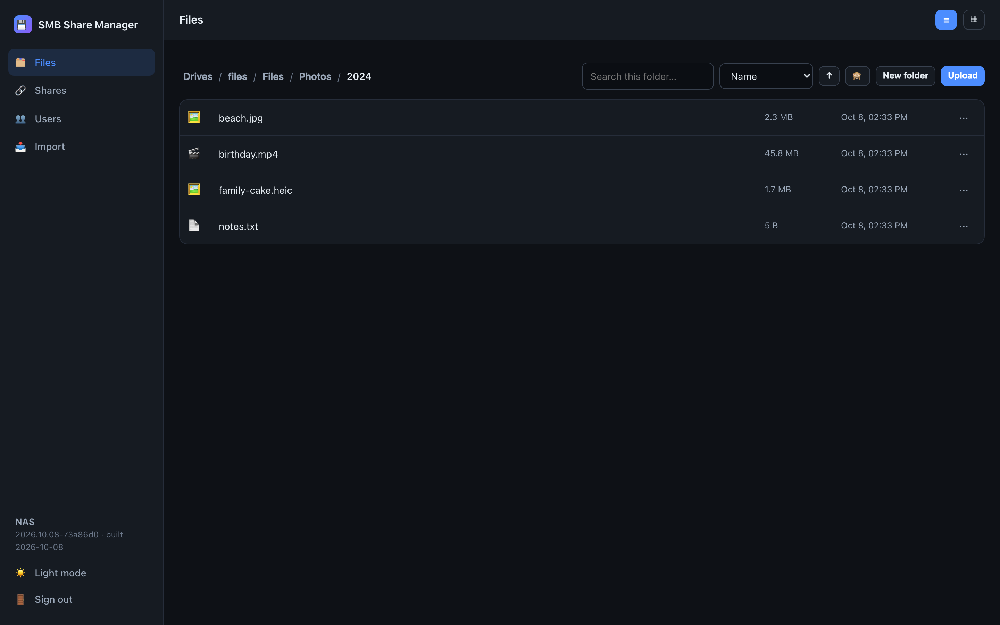
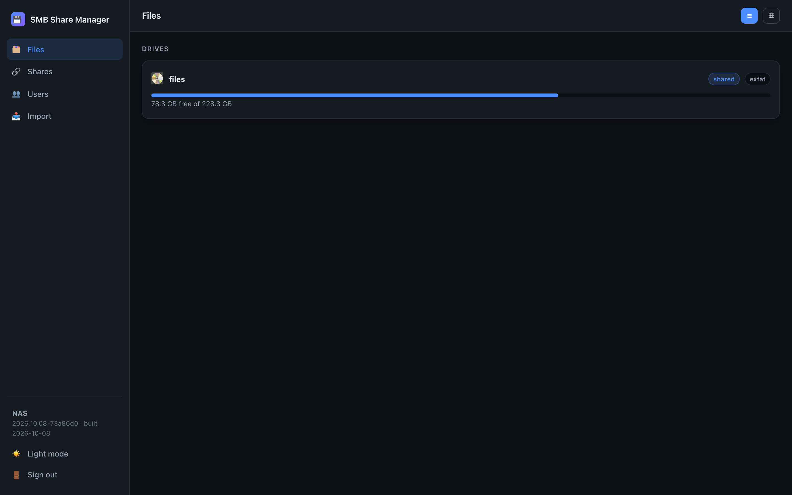
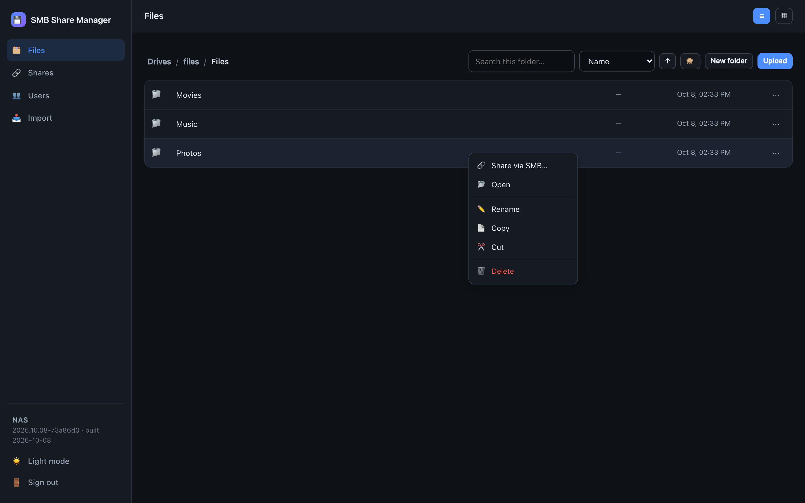
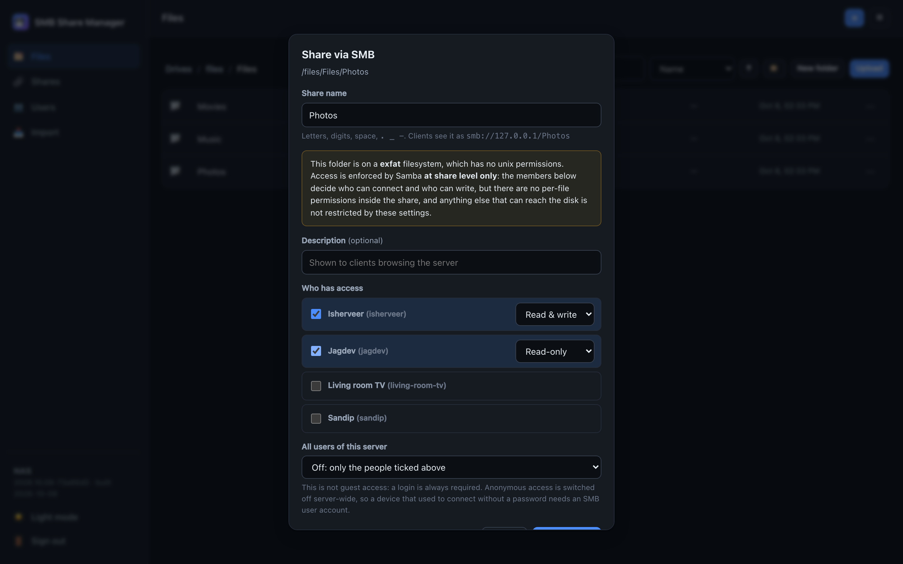
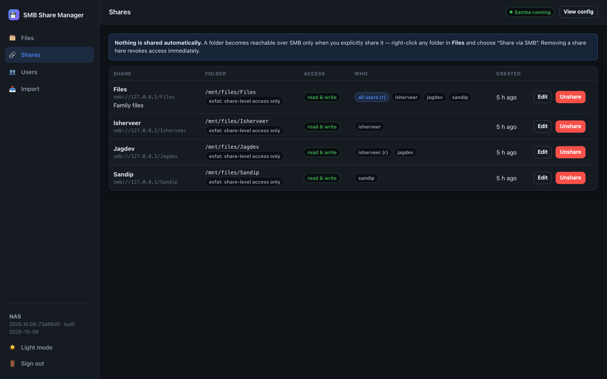
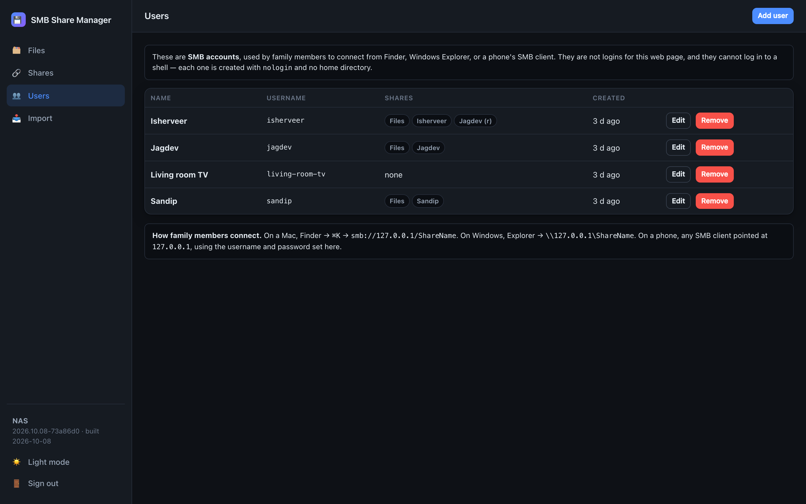

smb-share-manager
=================

A small Docker container with a web UI for one job: sharing folders over SMB (Samba) and
managing the SMB users who can reach them. It is the file browser, Shares and Users part
of nas-dashboard, without the dashboard and apps, on a hardened backend, with images
published automatically so the server only ever pulls.



What it does:

- admin login (one admin)
- Files: browse the folders you mount, as drives; list or grid view, sort, search this
  folder, new folder, rename, copy/cut/paste, delete, upload with progress, download.
  Files are always downloaded, never opened in the page.
- right-click a folder and choose "Share via SMB": pick who gets read-only or read & write
  access
- Shares: see every share and who can use it, edit, unshare (connected clients are
  disconnected), view the live Samba configuration, check that Samba agrees with the UI,
  fix a share folder's permissions on unix filesystems (only after you tick to confirm)
- Users: SMB accounts with a display name; create, change password, remove
- Import: one-time import of users (with their old passwords) and shares from CasaOS or
  another Samba server
- a warning when a folder is on exFAT/FAT/NTFS, where access is enforced by Samba at share
  level only
- light and dark mode, works on a phone (long-press opens the menu)

It deliberately does nothing else: no system stats, no app launcher, no terminal, no file
preview, no telemetry and no update checks. It makes no network calls of its own.

How it works:

- The UI is a React app (from nas-dashboard) built into the image. It talks to a JSON API
  that needs a login session and a CSRF token for every change.
- smbd runs as root inside the container, because it has to switch to each SMB user.
- The web UI runs as your user (PUID/PGID, default 1000).
- Everything that needs root goes through a small helper. It is reachable only over a
  private unix socket and offers a fixed list of operations, not a command runner.
- All state lives in ./data next to docker-compose.yml.

SECURITY.md describes the threat model and docs/UPDATING.md describes automatic updates.


Screenshots
-----------

Sample data from a local demo build.

Drives, then a folder:



Right-click a folder to share it:





Shares and SMB users:





Light mode and the login screen: [light mode](docs/screenshots/files-light.png),
[login](docs/screenshots/login.png).


Requirements
------------

- Linux with Docker and Docker Compose
- The folders you want to share, on the host (e.g. /mnt/files)
- Nothing else may listen on ports 445/139 on the host (stop the host Samba first, or use
  other ports while testing; see "Trying it beside CasaOS")


Install
-------

Pick a folder for the compose project, for example ~/docker/smb-share-manager:

```bash
mkdir -p ~/docker/smb-share-manager && cd ~/docker/smb-share-manager
```

```bash
curl -fsSLO https://raw.githubusercontent.com/codemastervy/smb-share-manager/main/docker-compose.yml
```

```bash
curl -fsSL -o .env https://raw.githubusercontent.com/codemastervy/smb-share-manager/main/.env.example
```

```bash
mkdir -p scripts && curl -fsSL -o scripts/smoke-test.sh https://raw.githubusercontent.com/codemastervy/smb-share-manager/main/scripts/smoke-test.sh && chmod +x scripts/smoke-test.sh
```

Edit .env. The only setting you must change is ADMIN_PASSWORD (at least 10 characters).
Keep the file private:

```bash
chmod 600 .env
```

Check the volume list in docker-compose.yml. By default only /mnt/files is mounted, at
the same path inside the container, and VOLUMES=/mnt/files in .env must match. Never
mount /, /proc, /sys or /mnt/timenest (the Time Machine disk): what isn't mounted can't be
browsed or shared.


exFAT disk permissions (do this once)
-------------------------------------

exFAT has no unix permissions. Ownership and access bits come from the mount options. With
the current root:root 755 mount, only root can write, so neither the SMB users nor the
folder browser could create files.

Mount /mnt/files so that your user owns it and the container's SMB group (gid 3000,
"smbusers") can write. In /etc/fstab, change the options of the /mnt/files line to:

```
uid=1000,gid=3000,umask=0002
```

A full line looks like this (keep your own UUID and any other options such as nofail):

```
UUID=XXXX-XXXX  /mnt/files  exfat  uid=1000,gid=3000,umask=0002,nofail  0  0
```

This replaces the older uid=1000,gid=1000,umask=000 line and still works for everything
else that uses the disk. It takes effect after a reboot (or an unmount and mount when
nothing is using the disk).

What this means: on exFAT, Samba enforces who may read or write at share level, by the
share's member list. Inside a share there are no per-file permissions. The UI warns about
this when you share an exFAT folder.

On ext4 or other unix filesystems, a share folder must belong to group 3000 and be
group-writable. The share's edit page shows the exact change and applies it only when you
tick "fix permissions". It changes the folder itself, never anything inside it.


First run
---------

```bash
docker compose up -d
```

```bash
docker compose ps
```

Wait until the status shows "healthy", then open http://<server>:8095 and log in with
ADMIN_PASSWORD. If you reach the UI by host name (for example nuc or nuc.tailnet.ts.net),
add that name to ALLOWED_HOSTS in .env. IP addresses always work.

Then:

1. Users: Add user.
2. Files: open the "files" drive, right-click a folder and choose "Share via SMB".
3. Tick the user, choose read-only or read & write, and click "Share folder".
4. On a Mac: Finder, Go, Connect to Server, smb://<server>, then log in as that user.
5. To stop sharing: Shares, "Unshare". Clients are disconnected and the folder is not
   touched.

If the container keeps restarting, check the log:

```bash
docker compose logs --tail 50
```

It refuses to start without ADMIN_PASSWORD or ADMIN_PASSWORD_HASH.


Trying it beside CasaOS
-----------------------

You can run it while CasaOS's Samba still owns ports 445/139. In .env set:

```
SMB_PORT_445=1445
SMB_PORT_139=1139
```

```bash
docker compose up -d
```

Create a test user and share, then connect with smb://<server>:1445 from a Mac. From
Linux, use smbclient -p 1445.


Migrating from CasaOS
---------------------

The order matters. The old Samba is stopped before its password database is copied, so the
copy is consistent. The import copy contains password hashes, so it is root-only and
removed afterwards.

1. Back up the old Samba configuration and state:

```bash
sudo tar -czf ~/samba-backup-$(date +%Y%m%d).tar.gz /etc/samba /var/lib/samba
```

2. Stop the host Samba (CasaOS uses the system smbd/nmbd):

```bash
sudo systemctl stop smbd nmbd
```

3. Copy the old configuration and passdb into ./import, readable by root only:

```bash
sudo mkdir -p import && sudo cp -a /etc/samba import/etc-samba && sudo cp -a /var/lib/samba import/var-lib-samba && sudo chown -R root:root import && sudo chmod 700 import
```

4. In docker-compose.yml, uncomment this line:

```
      - ./import:/import:ro
```

5. In .env, set the real ports (or remove the two lines):

```
SMB_PORT_445=445
SMB_PORT_139=139
```

6. Start (or recreate) the container:

```bash
docker compose up -d
```

7. Open the Import page in the sidebar:
   - Import each user first. Users keep their old SMB password, and the hash never
     leaves the container's root helper.
   - Then import each share. Check the folder path: CasaOS paths such as /DATA/... must
     be changed to the path here, e.g. /mnt/files/....
   - Shares that were anonymous (guest) are flagged. They now need an SMB login, because
     anonymous access is switched off. Tick the box to confirm, and give those devices a
     user account.

8. Remove the import data again. Comment out the ./import line in docker-compose.yml, then:

```bash
sudo rm -rf import
```

```bash
docker compose up -d
```

The UI shows a warning banner for as long as /import is still mounted.

9. Check that everything works:

```bash
SMB_SHARE=Files SMB_USER=isherveer ./scripts/smoke-test.sh
```

10. Stop the host Samba from coming back at boot:

```bash
sudo systemctl disable smbd nmbd
```

To roll back: run docker compose down, then sudo systemctl start smbd nmbd. Your old
configuration was never modified.


Checking from a Mac (do this once after go-live)
------------------------------------------------

CI can't drive Finder, so check these by hand:

1. Finder, Go, Connect to Server, smb://<server>: the login prompt appears. Choosing
   "Guest" must fail.
2. Log in as a member: the share opens. Copy a file in (read/write members) or confirm
   that copying fails (read-only members).
3. Log in as a non-member: the share is not accessible.
4. Remove the share in the web UI: Finder's window for it disconnects or reports an
   error.
5. Optional, to check that signing or encryption is active on the connection: run this in
   Terminal while connected and look at SIGNING_ON / ENCRYPTION:

```bash
smbutil statshares -a
```


Configuration (.env)
--------------------

| Variable | Default | Meaning |
|---|---|---|
| ADMIN_PASSWORD |  | Admin password (min. 10 characters). Required unless ADMIN_PASSWORD_HASH is set. |
| ADMIN_PASSWORD_HASH |  | argon2id hash instead of a plain password (write $ as $$ in .env). |
| VOLUMES | /mnt/files | Comma-separated folders that can be browsed and shared (container paths; mount them at the same path). |
| WEB_PORT | 8095 | Host port of the web UI. |
| BIND_ADDR | 0.0.0.0 | Host address the web UI listens on (e.g. a LAN or Tailscale IP). |
| ALLOWED_HOSTS |  | Extra host names accepted in the Host header (IPs and localhost are always accepted). |
| TRUSTED_PROXIES |  | Reverse proxies whose X-Forwarded-For/-Proto are believed. Default: none. |
| COOKIE_SECURE | auto | auto, true or false. Use true behind an HTTPS proxy that is not in TRUSTED_PROXIES. |
| MAX_UPLOAD_MB | 4096 | Upload size limit per file. |
| SMB_PORT_445 / SMB_PORT_139 | 445 / 139 | Host ports for SMB. |
| SMB_BIND_ADDR | 0.0.0.0 | Host address SMB listens on. |
| SMB_SERVER_NAME | NAS | Server name shown to clients (max 15 characters). |
| SMB_HOSTS_ALLOW |  | Optional allow-list of client networks, e.g. 192.168.68.0/24,100.64.0.0/10. |
| ENABLE_NMBD | false | NetBIOS name service (not needed by macOS or Windows 10+). |
| PUID / PGID | 1000 / 1000 | User and group the web UI runs as. |

The SMB group "smbusers" is fixed at gid 3000, and SMB users get uids from 3000 up. These
accounts only exist inside the container and can't log in to anything except Samba.


Ports, networking and why not host networking
---------------------------------------------

The container uses normal published ports, not host networking:

- It stays out of the host's network namespace and needs no NET_ADMIN or NET_RAW.
- Docker keeps the real client address for LAN and Tailscale clients, so the login
  throttle and SMB_HOSTS_ALLOW see real peers.

SMB needs only TCP 445; 139 is kept for old clients. The cost is no NetBIOS broadcast
browsing, which macOS and current Windows don't use: connect with smb://<server>.


Updating and rolling back
-------------------------

See docs/UPDATING.md. In short:

- Images are published to ghcr.io/codemastervy/smb-share-manager with the tags latest,
  YYYYMMDD and sha-<commit>.
- To pin or roll back, replace :latest in docker-compose.yml with a dated tag and run
  docker compose up -d.


Development
-----------

```bash
uv sync
```

```bash
uv run ruff check . && uv run ruff format --check . && uv run mypy && uv run bandit -q -r src -c pyproject.toml && uv run pytest
```

The web UI:

```bash
cd frontend && npm ci --ignore-scripts && npm run build
```

`npm run dev` serves the UI with live reload and forwards /api to a container on
port 8095.

The integration tests (tests/integration) need Docker and run in CI against the built
image, on both an exFAT loop mount and ext4. They include a real-browser test (Chromium)
of the UI. See scripts/ci/integration.sh.
